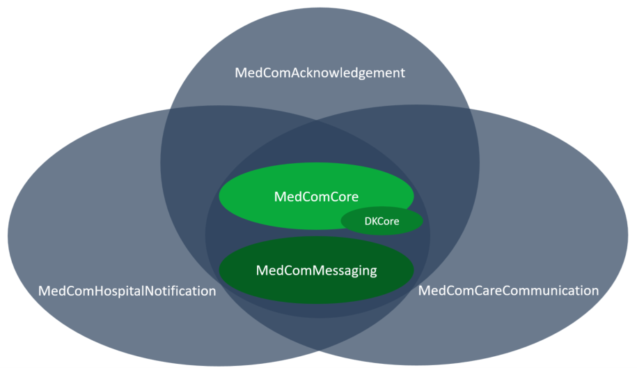

# Frequently asked qustions 

On this page you will finde the answears to the most asked questions.
**Table of contents**
* [ 1 Why are there Multiple Implementation Guides? ](#why-are-there-multiple-implementation-guides)
* [2 How does Inheritance Work and What is DKCore? ](#how-does-inheritance-work-and-what-is-dkcore)

## 1 Why are there Multiple Implementation Guides? {#Why-are-there-multiple-implementation-guides}

FHIR allows for a great deal of reuse. When creating a MedCom FHIR message, profiles from the MedComCore and MedComMessaging IG are used to create a complete understanding. Currently, there are three FHIR standards: HospitalNotification, CareCommunication and Acknowledgement, which all are composed of profiles from the Core and Messaging IG as well as the IG for the specific standard, and terminogy codes from the Terminology IG. 

Keeping the IG's seperate allows us to version them individually,meaning that updates in the MedComHospitalNotification IG will not affect the version of the MedComCareCommunication IG. However, an update in the MedComMessaging IG will affect all standard that use profiles or inherit profiles from this IG. 
Additionally, it makes it possible to reuse the profiles from the Core IG in different MedCom standard and in different exchange formats. 

<a href="#Fig1"> Figure 1</a> illustrates that the messaging standard uses multiple profiles from the Core and Messaging IG and uses some profiles that are specific to the given standard. 

<figure>

<figcaption text-align="center"><b>Figure 1: Overview of the MedCom Messaging Standard </b></figcaption>
</figure>
 
 

## How does Inheritance Work and What is DKCore? {#how-does-inheritance-work-and-what-is-dkcore}
In Denmark, we have a national HL7 affiliate, called <a href="https://hl7.dk/" target="_blank">HL7-DK</a>. The affiliate works on the development of international HL7 standards that supports healthcare. HL7-DK has focuses on profiling the international standard in a Danish context to provide a common foundation in Denmark.  HL7-DK develops DK-core which are generic FHIR profiles that can be used freely for FHIR projects in Denmark. At present, DK-core includes the following profiles: DkCorePatient, DkCorePractitioner and DkCoreOrganization. The profile MedComCorePatient inherits from <a href="https://hl7.dk/fhir/core/1.1.0/StructureDefinition-dk-core-patient.html" target="_blank">DKCorePatient</a>. This means that when a MedCom standard uses a civil registration number (Danish: CPR-nummer) from DKCorePatient, it is defined in the same way as when other projects inherit from DK-core and use a civil registration number, securing consistency across projects. DKCorePatient is the foundation of MedComCorePatient,which is why MedComCorePatient is said to inherit from DKCorePatient. 

<figure>

<figcaption text-align="center"><b>Figre 2: The inheritance of profiles </b></figcaption>
</figure>

<a href="#Fig2">Figure 2 </a> also illustrates that there is a dependency between the IGs and the FHIR resources defined by HL7. 
 
<a href="https://www.medcom.dk/standarder/moderniseringsnyheder/nyhedsbrev-29-november-2021" target="_blank">You can read more about the work of HL7-DK here</a>. 

