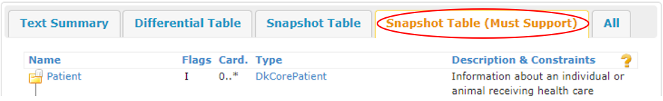

[Return](NewToFHIR.md)

# Step-by-Step Guide
This step-by-step guide aims to present the basic content and the composition of an IG. Furthermore the guide aims to explain the structure of the MedCom FHIR profiles. The guide is based on the <a href="https://build.fhir.org/ig/medcomdk/dk-medcom-core/" target="_blank">MedCom Core Implementation Guide (IG)</a>. 

## Step 1
 Go to <a href="https://build.fhir.org/ig/medcomdk/dk-medcom-core/" target="_blank">MedCom Core IG</a>.
* On the front page of the MedCom Core IG, you will find a short introduction to the content of the IG and a menu bar at top of the page (see <a href="#Fig1" rel="noopener noreferrer"> Figure 1 </a>):
<figure>

<figcaption text-align="center"><b>Figure 1: Menu on IG page</b></figcaption>
</figure>

On the menu bar, you will find the following tabs: 
* <a href="https://build.fhir.org/ig/hl7dk/dk-medcom-core/toc.html" target="_blank">Table of Contents</a> shows the content list of the IG
* <a href="https://build.fhir.org/ig/medcomdk/dk-medcom-core/index.html" target="_blank">Home</a> shows the front page of the IG
* <a href="https://build.fhir.org/ig/medcomdk/dk-medcom-core/profiles.html" target="_blank">Profiles</a> shows which profiles are included in the IG
* <a href="https://build.fhir.org/ig/medcomdk/dk-medcom-core/extensions.html" target="_blank">Extensions</a> shows the extensions made for the IG. 
<!-- * The tab <a href="https://build.fhir.org/ig/hl7dk/dk-medcom-core/terminology.html" target="_blank">Terminology</a> shows the CodeSystems and ValueSets used in the IG. -->
* <a href="https://build.fhir.org/ig/medcomdk/dk-medcom-core/artifacts.html" target="_blank">Artifacts</a> shows the entire content of the IG.
* <a href="https://build.fhir.org/ig/medcomdk/dk-medcom-core/downloads.html" target="_blank">Download</a> shows the possible download format of the IG. 
 
 

## Step 2
Click on the tab <a href="https://build.fhir.org/ig/medcomdk/dk-medcom-core/profiles.html" target="_blank">Profiles</a> (see the red circle in <a href="#Fig2" rel="noopener noreferrer">Figure 2</a> ) to get an overview of which profiles are in the IG.
<figure>
 
<figcaption text-align="center"><b>Figure 2: Profile highlighted in IG menu</b></figcaption>
</figure> 
 
 

## Step 3
  Choose <a href="https://build.fhir.org/ig/medcomdk/dk-medcom-core/StructureDefinition-medcom-core-patient.html" target="_blank">MedComCorePatient</a>(see the red circle in <a href="#Fig3">Figure 3</a>), and you will get to the front page of MedComCorePatient, (see <a href="#Fig4" rel="noopener noreferrer">Figure 4 </a>). This page introduces the MedComCorePatient profile. It includes a short description of the profile, its usage and the required content. 

<figure>
 
<figcaption text-align="center"><b>Figure 3: Overview of the associated profiles for MedCom Core IG </b></figcaption>
</figure> 

<figure>

<figcaption text-align="center"><b>Figure 4: Menu bar for the profile "MedComCorePatient"</b></figcaption>
</figure>

On top of the MedComCorePatients front page, you will find a menu bar with the following tabs: 
   * <a href="https://build.fhir.org/ig/medcomdk/dk-medcom-core/StructureDefinition-medcom-core-patient.html#"> <b>Content</b></a>:  Gives a short introduction to the profile and a table showing the profile content 
   * <a href="https://build.fhir.org/ig/medcomdk/dk-medcom-core/StructureDefinition-medcom-core-patient-definitions.html"> <b>Detailed Description </b></a>: Gives a detailed description of all elements in the profile  
   * <a href="https://build.fhir.org/ig/medcomdk/dk-medcom-core/StructureDefinition-medcom-core-patient-mappings.html"><b>Mapping</b></a>: Gives an overview of how terms in the standard can be mapped to other HL7 standards, but not previuos MedCom standards. To get this information, you can look under each standard.
   * <a href="https://build.fhir.org/ig/medcomdk/dk-medcom-core/StructureDefinition-medcom-core-patient-examples.html"><b>Examples</b></a>: Gives an overview of the examples for the given profile as in this case for the MedComCorePatient profile 
       *  If you select one of the examples you will be presented with the content of the narrative text. If you select the tabs XML, JSON or TTL instead, you will see the entire content of the MedComCorePatient.  
   * <a href="https://build.fhir.org/ig/medcomdk/dk-medcom-core/StructureDefinition-medcom-core-patient.profile.xml.html"><b>XML</b></a>: Shows the entire content of the MedComCorePatient profile in XML format
   * <a href="https://build.fhir.org/ig/medcomdk/dk-medcom-core/StructureDefinition-medcom-core-patient.profile.json.html"><b>JSON</b></a>: Shows the entire content of the MedComCorePatient profile in JSON format
   * <a href="https://build.fhir.org/ig/medcomdk/dk-medcom-core/StructureDefinition-medcom-core-patient.profile.ttl.html"><b>TTL</b></a> Shows the entire content of the MedComCorePatient profile in TTL format         
 
 

## Step 4
If you scroll down the MedComCorePatients front page, you will find a menu bar with five tabs where three of them represent tables that explain 'The content of the profile' and which changes are made from the parent profile or resource, which, is in this case DkCorePatient (see <a href="#Fig5" rel="noopener noreferrer"> Figure 5</a>). .  
* The three tables are: 
    * <b>Differential Table</b>: Shows what is changed from the resource the profile is based on.  
    * <b>Snapshot Table</b>: Shows all the content of a profile. Not all should be included in a MedCom standard. 
    * <b>Snapshot Table(Must Support)</b>: Shows the required content of a profile.

<figure>

<figcaption text-align="center"><b>Figure 5: Menu bar with the overview of the profile 'MedComCorePatient content'</b></figcaption>
</figure>
 
 

## Step 5
Click on the tab 'Snapshot Table (MustSupport)'(see <a href="#Fig6" rel="noopener noreferrer"> Figure 6</a>). It is important to notice that the sender and receiver system must be able to handle the content shown when choosing the tab "Snapshot Table (MustSupport)". 
<figure>

<figcaption text-align="center"><b>Figure 6: Content of the 'Snapshot Table (MustSupport)'</b></figcaption>
</figure>

The table contains five headlines (see <a href="#Fig6" rel="noopener noreferrer"> Figure 6</a>):
* **Name**:
    * The element name.
* **Flags**: 
    * I = a rule.It can be seen further down the page.
    * &sum; = summary. It describes if it is possible to search for the content of the element. 
    * ?! = modifier element. An element which potentially can modify the understanding of an entire message.And example could be if the patient is deceased as it changes the understanding of the content. 
* **Cardinality (Card)**:
    * Cardinality describes how many times an element may or must appear.  Given the minimum cardinality of 1 for Patient.identifier and Patient.name, the information for these elements must always be included when exchanging a MedCom standard. Not only must a Patient.name be included, but it must also always be the patient's official name, indicated by Patient.name:Official. Information about Patient.telecom, Patient.deceased, Patient.address and Patient.managingOrganization must be included if the information is available in the sender system, given the minimum cardinality of 0. 
    * Given the maximum cardinality of * for Patient.identifier, Patient.name, Patient.telecom and Patient.address it is allowed to slice the element. For the element Patient.deceased, it is only allowed to include the information once. 
* **Type**: 
    * Describes the data type of the element. For more information about the data type click here. 
    * One might notice the type at the top of the elements saying _DKCorePatient_, which means that the MedComCorePatient profile inherits from a Patient profile developed by the Danish HL7 affiliate. <a href="https://medcomdk.github.io/MedComLandingPage/assets/documents/NewToFHIR.html#how-does-inheritance-work-and-what-is-dkcore " target="_blank">You can read more about inheritance and the work for HL7 Denmark here.</a>
* **Description and Constraints**:
    * A short description of the element as well as rules associated with the element.
 
 

## Step 6   
Now you can, choose another profile; namely the <a href="https://build.fhir.org/ig/medcomdk/dk-medcom-core/StructureDefinition-medcom-core-encounter.html" target="_blank">MedComCoreEncounter</a>
* Here you will see the type Reference(...) at the element Encounter.subject. This means that the element references the MedComCorePatient profile and that an encounter must always be associated with a patient. 
* For the elements Encounter.status and Encounter.class, the type is code or coding, meaning that a predefined structured code must be selected from a ValueSet. which can be seen in the column 'Description & Constraints'.  
 

