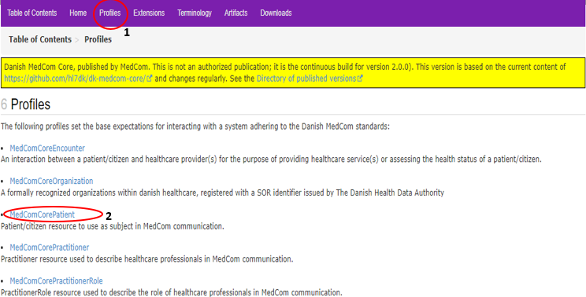
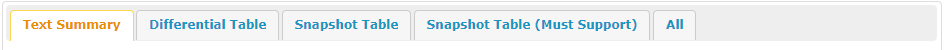

[Return](NewToFHIR.md)

# Step-by-Step Guide
This step-by-step guide takes its starting point in <a href="https://build.fhir.org/ig/hl7dk/dk-medcom-core/" target="_blank">MedCom Core Implementation Guide (IG)</a>. 

* Go to <a href="https://build.fhir.org/ig/hl7dk/dk-medcom-core/" target="_blank">MedCom Core IG</a>.
* On the front page of the MedCom Core IG you'll find a short introduction to the IG, in this case the MedComCore profiles. 
    * On top of the front page you will finde a topbar (see <a href="#Fig1"> Figure 1</a> ):
    <figure>
    
    <figcaption text-align="center"><b>Figre 1: Menu on IG page </b></figcaption>
    </figure>

* Click on the tab <a href="https://build.fhir.org/ig/hl7dk/dk-medcom-core/profiles.html" target="_blank">Profiles</a> (se red circle 1 on <a href="Fig2">Figure 2</a> ) to get an overview of which profiles are in the IG.
    <figure>
     <figcaption text-align="center"><b>Figre 2: Overview of the associated profiles for MedCom Core IG </b></figcaption>
    </figure> 
    * Choose <a href="https://build.fhir.org/ig/hl7dk/dk-medcom-core/StructureDefinition-medcom-core-patient.html" target="_blank">MedComCorePatient</a>(see red circle 2 on <a href="Fig2">Figure 2</a>), and you will get to the front page of MedComCorePatient, called 'Content' (see <a href="Fig3">Figure 3</a>)
   
    <figure>
     <figcaption text-align="center"><b>Figure 3: Content of the Profile </b></figcaption>
    </figure

    * On top of the profile 'Content' page you will finde a menubar with folowing tabs: 
        * **Content** 
        * <a href="https://build.fhir.org/ig/hl7dk/dk-medcom-core/StructureDefinition-medcom-core-patient-definitions.html" target="_blank"> <b>Detailed Description </b></a>: Gives a detailed description of all elements in the profile  
        * <a href="https://build.fhir.org/ig/hl7dk/dk-medcom-core/StructureDefinition-medcom-core-patient-mappings.html" target="_blank"><b>Mapping</b></a>: Gives an overview of how terms in the standard can be mapped to other HL7 standards, but not the previuos MedCom standards. To get this information you must look under each standard.
        * <a href="https://build.fhir.org/ig/hl7dk/dk-medcom-core/StructureDefinition-medcom-core-patient-examples.html" target="_blank"><b>Examples</b></a>: Gives an overview of the examples for the gine profile as in this case for the MedComCorePatient profile 
            *  If you select one of the examples you will be presented for the content of the narrative text. If you instead select the tabs XML, JSON or TTL you will see the entire content of the MedComCorePatient.  
        * <a href="https://build.fhir.org/ig/hl7dk/dk-medcom-core/StructureDefinition-medcom-core-patient.profile.xml.html" target="_blank"><b>XML</b></a>: Shows the entire content of the MedComCorePatient profile in XML format
        * <a href="https://build.fhir.org/ig/hl7dk/dk-medcom-core/StructureDefinition-medcom-core-patient-examples.html" target="_blank"><b>JSON</b></a>: Shows the entire content of the MedComCorePatient profile in JSON format
        * <a href="https://build.fhir.org/ig/hl7dk/dk-medcom-core/StructureDefinition-medcom-core-patient.profile.json.html" target="_blank"><b>TTL</b></a> Shows the entire content of the MedComCorePatient profile in TTL format         
    * If you click on XML, JSON og TTL you see StructureDefinition of the profile, which reflects the content. 

      *  On the 'Content' page you will find  a short introduction to the profile and a table including five tabs, where three are of special interest:  There are multiple tabs in the table, and a short describtion of them is given here: 
      
        * Click on the tab 'Snapshot Table (MustSupport)'. Here is all required content for the profil gathered. The table contains five headlines
                
                * Name
                    * The element name.
                * Flags: 
                    * I = a rule, which can be seen further down the page.
                    * &sum; = if the element shall be included in the narrativ. 
                    * ?! = modifier element, an element which potentially can modify the understanding of an entire message
                * Cardinality (Card):
                    * Given the minimum cardinality of 1 for Patient.identifier and Patient.name the information for these elements shall always be included when exchanging a MedCom standard. Not only shall a Patient.name be included, it shall always be the patients offical name, indicated by Patient.name:Official. Information about Patient.telecom, Patient.deceased, Patient.address and Patient.managingOrganization shall be included if the information is available in the sender system, given the minimum cardinality of 0. 
                    * Given the maximum cardinality of * for Patient.identifier, Patient.name, Patient.telecom and Patient.address it is allowed to slice the element. For the element Patient.deceased it is only allowed to include the information once. 
                * Type: 
                    * Describes the datatype of the element. Click on them for more information about the datatype. 
                    * One migth notice the type at the top of the elements says _DKCorePatient_, which means that the MedComCorePatient inherits from a Patient profile developed by the Danish HL7 affiliate. [You can read more about inheritance and the work for HL7-Denmark here](docs\assets\documents\NewToFHIR.md).
                * Description and Constraints
                    * A short description of the element as well as rules associated with the element.
      
    * Now, try choosing the profile <a href="https://build.fhir.org/ig/hl7dk/dk-medcom-core/StructureDefinition-medcom-core-encounter.html" target="_blank">MedComCoreEncounter</a>
        * Here you'll see the type Reference(...) at the element Encounter.subject. This means that the element references the MedComCorePatient profile, and that an encounter always shall be associated with a patient. 
        * For the elements Encounter.status and Encounter.class the type is code or coding, meaning that a predefined, structured code shall be selected from a ValueSet. which can be seen in the column 'Description & Constraints'.  
* The tab <a href="https://build.fhir.org/ig/hl7dk/dk-medcom-core/extensions.html" target="_blank">Extensions</a> shows the extensions made for the IG. 
* The tab <a href="https://build.fhir.org/ig/hl7dk/dk-medcom-core/terminology.html" target="_blank">Terminology</a> shows the CodeSystems and ValueSets used in the IG.
* The tab <a href="https://build.fhir.org/ig/hl7dk/dk-medcom-core/artifacts.html" target="_blank">Artifacts</a> shows entire content of the IG.

[More information about IGs can be found here](https://medcomdk.github.io/MedComLandingPage/assets/documents/NewToFHIR.html#hl7-fhir-documentation)

# Release Notes

[The latest changes of this page can be found here.](ReleaseNotesFHIRImplementationGuide.md)