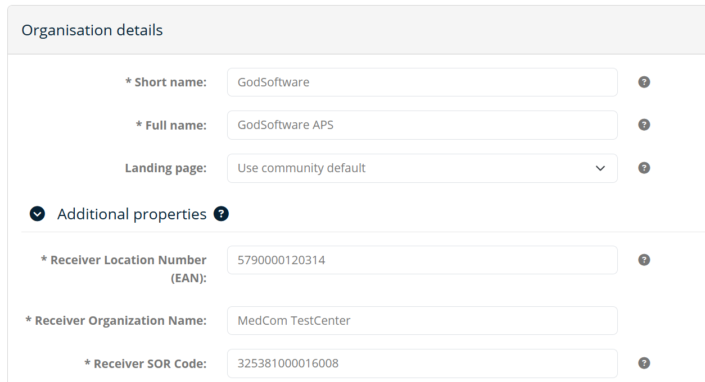
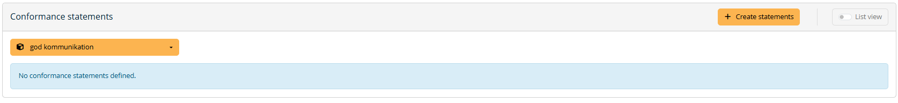
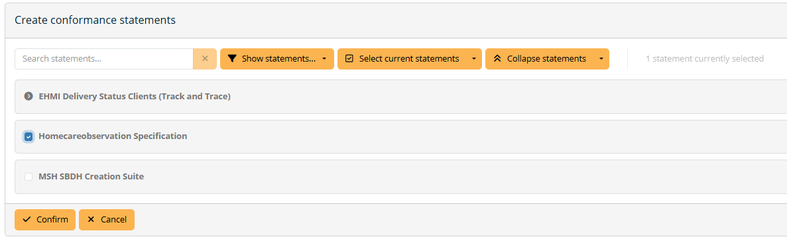
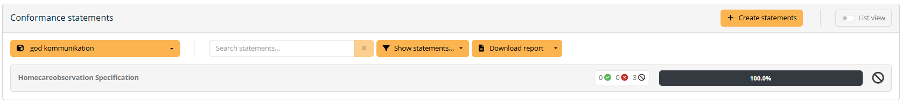
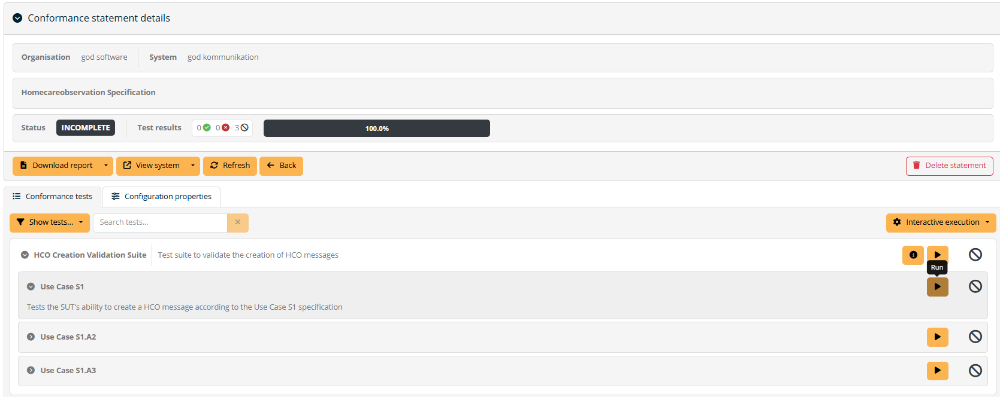
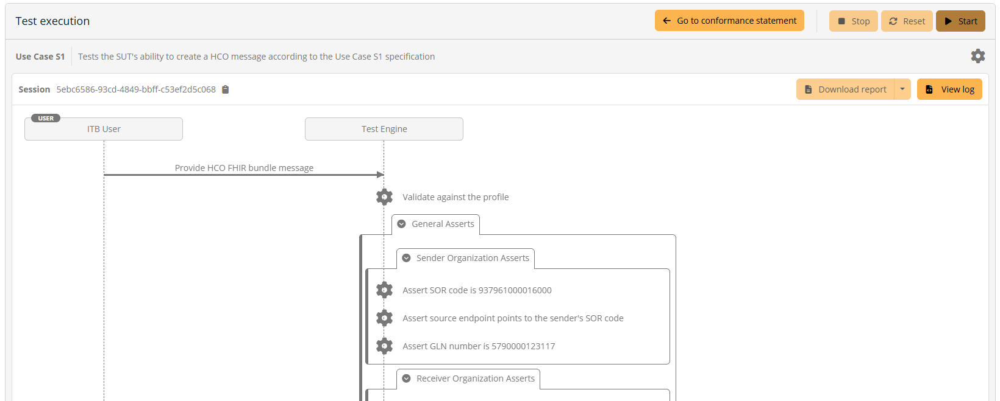
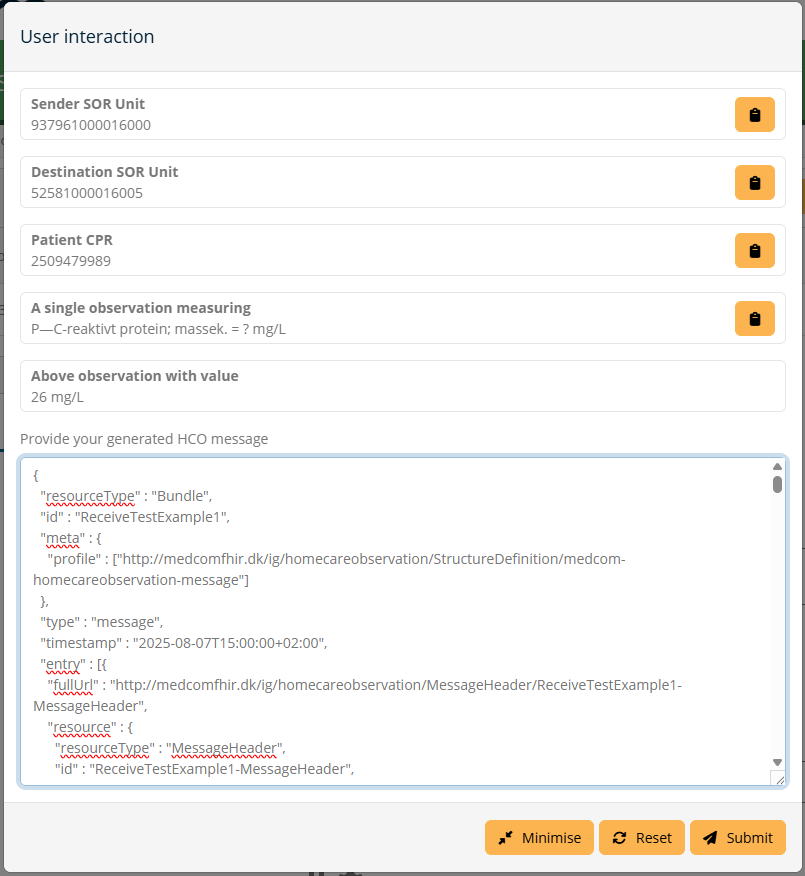
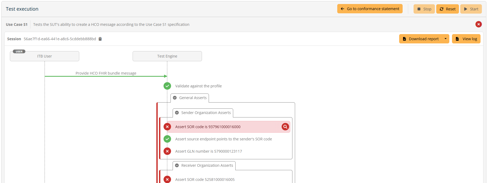
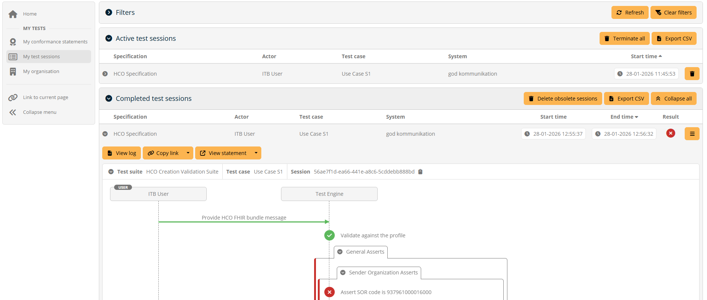

[Return](../../index.md)

# Interoperability Test Bed (ITB) - Getting Started

The test tool "Interoperability Test Bed (ITB)", is used to perform tests of MedCom FHIR standards.

## 1 How to register
<ol>
  <li> 
    Go to <a href="https://test.itb.medcom.dk/" target="_blank">ITB Login</a>
  </li>
  <li> 
    Check within your organization whether or not your organization has been created for this MedCom Community in ITB.
     
    If your organization has already been registered for this community, please contact your local admin to make them create a user for you. Login with your credentials and skip the rest of these steps.
     
    If your organization has not been registered for this community, please continue.
   </li>
  <li>
    Click on "Register in a public community".
    <figure>
    
    </figure>
  </li>
  <li>
    Populate the fields with data that fits your organization. Below is an example with a organization called 'god software'.
    <figure>
    
    </figure>
  </li>
  <li>
    Click create and you will automatically be logged in.
  </li>
  <li>
    If additional information is available to add to your organization, please fill out these with relevant information for testing. For instance; When testing for CareCommunication we encourage you to fill in the SOR-id, EAN-number and name of the organization that you would like to be the receiver of the CareCommunication messages. This information is used when creating examples in the test cases.
    <figure>
    
    </figure>
  </li>
  
</ol>

# Create users
<ol>
  <li>
    As administrator you can now create users for people in your organization that needs to test using the ITB. Create them under "My organization" found in the lefthand navigation menu, click "Users" and fill in the information.
    <figure>
    
    </figure>
  </li>
</ol>

# Create system and add conformance statement
<ol>
  <li>
    As adminstrator you can also create the system that represents your software server/entity that is being tested in the ITB. Example: Let's say our organization is Microsoft, then we might have many systems such as Outlook, Word, PowerPoint etc. 
    <figure>
      
    </figure>
  </li>
  <li>
    In the lefthand navigation menu you can find "Conformance statements" which is where you will find the tests that your system are to conform to. Click "Create statements" and add the statement that your system should be conformant to.
  <figure>
    
  </figure>
  <figure>
    
  </figure>
  </li>
  <li>
    Click "Create" and you can now perform test cases in the selected Conformance statement(s).
  </li>
</ol>

# Perform a test
<ol>
  <li>
    Select which conformance statement you want to test your system against.
    <figure>
    
    </figure>
  </li>
  <li>
    Click "run" for the test case you want to perform.
    <figure>
    
    </figure>
  </li>
  <li>
    You are now on the test execution page, where you can see what is expected of you as an ITB User, and which tests and/or validation the test engine will perform. Click "Start" to start the test. 
    <figure>
    
    </figure>
  </li>
  <li>
    When testing that your system can generate a valid message or document, it will most often be required that you submit a file in the pop-up window. When testing FHIR, the file may be added in json or xml. Depending on the test case, there migth be some information or requirements before submitting, as in the picture below. 
    <figure>
    
    </figure>
  </li>
  <li>
    The test engine then performs the tests and validation, and the result can be seen on the test execution page. Click on each step to see the expected and actual result.
    <figure>
    
    </figure>
  </li>
  <li>
    To see the result for the entire conformance statement you can click on the "My conformance statement" on the left and you can see a general overview of your systems conformance to the test suite. You can also click on "My test session" on the left to see the result of the execution, as displayed below, as well as previous executions. 
    <figure>
    
    </figure>
  </li>
</ol>

# Need help?
Help to set up organization and system, getting through a test case or something similar? Please write to fhir@medcom.dk 
If you need help getting through a test case, it is very helpful if you send the link to the test execution you are struggling with, please click "Copy link" and send it to MedCom.