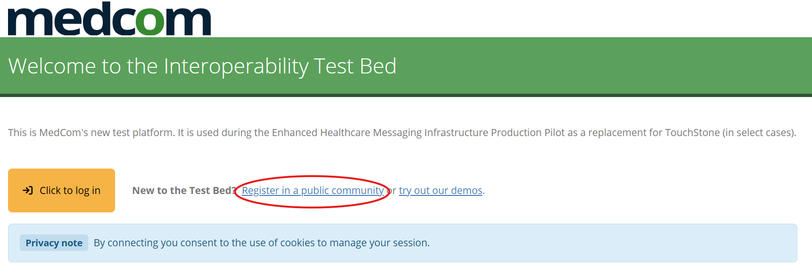
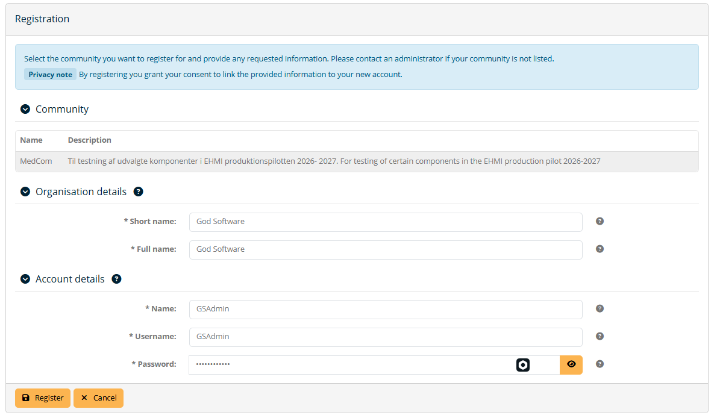
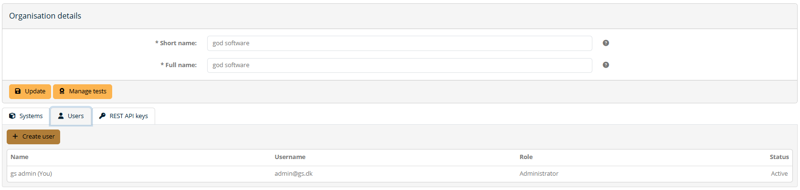

[Return](../../index.md)

# Interoperability Test Bed (ITB) - Getting Started

**Table of contents**
* [1 How to register](#1-how-to-register)

This page presents a short introduction to the test tool called "Interoperability Test Bed (ITB)", which is used to perform tests of MedCom FHIR standards.

## 1 How to register

1. Go to <a href="https://test.itb.medcom.dk/" target="_blank">ITB Login</a>

2. Your organization needs to be registered in the ITB. Please ensure nobody has already registered your organization for this ITB community. 

3. If your organization has already been registered for this community, please contact your local admin to make them create a user for you. Login with your credentials and skip the rest of these steps.

4. Click on "Register in a public community"

<figure>

</figure>

5. Populate the fields with data that fits your organization. Below is an example with a company called 'GodSoftware'.
<figure>

</figure>

6. Click create and you will automatically be logged in

7. You can now create people from your organization that needs to test using the ITB. Create them under "My organization" found in the lefthand navigation menu and click "Users"
<figure>

</figure>

8. You should also create the system that represents your software server/entity that is being tested in the ITB. Example: Let's say our organization is Microsoft, then we might have many systems such as Outlook, Word, PowerPoint etc. 

9. In the left hand navigation menu you can find "Conformance statements" which is where you will find the tests that you are to conform to.