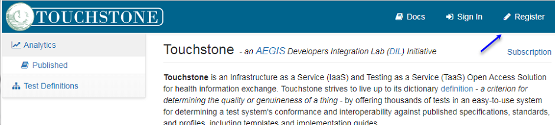

[Return](../../index.md)

# Touchstone Getting started

**Table of Contents**
* [1 How to register](#1-how-to-register)
* [2 How to run a Touchstone test script based on use cases](#2-how-to-run-a-touchstone-test-script-based-on-use-cases)
<!-- * [3 Touchstone .NET client Demo](#3-touchstone-net-client-demo)
* [4 Java FHIR client setup](#4-java-fhir-client-setup) -->

This page presents an short introduction to the test tool called "Touchstone" used to perform test of MedCom FHIR standards.
The introduction is divided in to two sections: the first section will contain information out how to register on "Touchstone", and the seccond section will contain information about how to run a testscript. 

## 1 How to register

1. To register please go to <a href="https://touchstone.aegis.net/touchstone/" target="_blank">Touchstone</a> and click on Register link (see <a href="#Fig1" target="_blank">Figure 1</a>):
<figure>

<figcaption text-align = "center"><b>Figure 1: Registration link </b></figcaption>
</figure>

1.	Go to https://touchstone.aegis.net/touchstone/register and follow the steps. (Create a “Free” account) 
2.	Follow this guide https://touchstone.aegis.net/touchstone/userguide/html/registration/membership.html#new-organization  to create your organization. 
3.	Send the organization name that is registered to fhir@medcom.dk 
4.	MedCom will ask AEGIS to raise your subscription level from “Free” to “Starter” 

 
 

## 2 How to run a Touchstone test script based on use cases
For information regarding how to run a Touchstone test script, please refer to:
[http://svn.medcom.dk/svn/drafts/TestProcedurer/Touchstone/MedcomTouchstoneTest/Guide%20to%20the%20mtt.docx](http://svn.medcom.dk/svn/drafts/TestProcedurer/Touchstone/MedcomTouchstoneTest/Guide%20to%20the%20mtt.docx)

<!-- ## 3 Touchstone .NET client Demo
[Demo of a .NET client](https://github.com/medcomdk/touchstone-client-demo-dotnet) calling the MedCom Touchstone test Suite 

## 4 Java FHIR client setup
[http://svn.medcom.dk/svn/drafts/TestProcedurer/Touchstone/MedcomTouchstoneTest/java%20FHIR%20client.pptx](http://svn.medcom.dk/svn/drafts/TestProcedurer/Touchstone/MedcomTouchstoneTest/java%20FHIR%20client.pptx) -->

<!-- ## 5 Release Notes

[The latest changes of this page can be found here.](ReleaseNotesTouchStoneGettingStarted.md) -->