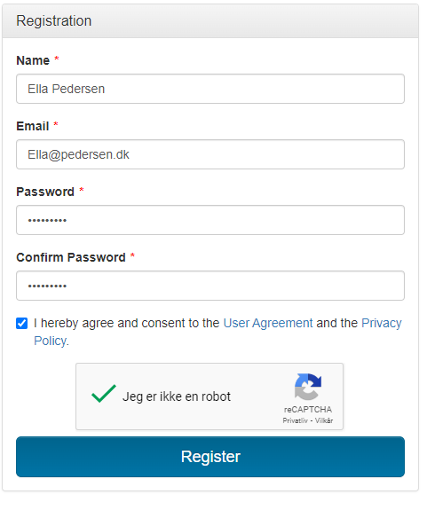

[Return](../../index.md)

# TouchStone Getting started

**Table of Contents**
* [1 How to register](#1-how-to-register)
* [2 How to run a Touchstone test script based on use cases](#2-how-to-run-a-touchstone-test-script-based-on-use-cases)

<!-- [3 Touchstone .NET client Demo](#3-touchstone-net-client-demo)
 [4 Java FHIR client setup](#4-java-fhir-client-setup) -->

This page presents an short introduction to the test tool called "TouchStone" used to perform test of MedCom FHIR standards.
The introduction is divided in to two sections: the first section will contain information out how to register on "TouchStone", and the seccond section will contain information about how to run a testscript. 

## 1 How to register

1. To register please go to <a href="https://touchstone.aegis.net/touchstone/" target="_blank">Touchstone</a> and click on Register link (see <a href="#Fig1" target="_blank">Figure 1</a>):

    <figure>
    
    <figcaption text-align = "center"><b>Figure 1: Registration link </b></figcaption>
    </figure>

2. Fill the fields and click on the Register button (see  <a href="#Fig2" target="_blank">Figure 2</a>):

    >Note: the password must be at least 8 characters long and must contain number, upper case letter, and special character. 

    <figure>
    
    <figcaption text-align = "center"><b>Figure 2:example of a completed registration form  </b></figcaption>
    </figure>

3. To get acces to MedCom testscrptis you need to be part of MedCom organization. Pleas click on the "Organizations" and then "Become a member" buttons (see <a href="#Fig3" target="_blank">Figure 3</a> )
    <figure>
    
    <figcaption text-align = "center"><b>Figure 3: Organization menu </b></figcaption>
    </figure>

4. Tick the <i>"Become a member of an existing organization"</i>: and select MedCom (see <a href="#Fig4" target="_blank">Figure 4</a>  ). Send the request of being a member by hitting the Submit button. 
    <figure>
    
    <figcaption text-align = "center"><b>Figure 4: Application for membership  </b></figcaption>
    </figure>

After the request has been submitted, you will need to wait for approval before you can execute tests in the system. As soon as we accept your organization you will be notified via email. Pleas check your Spam folder in your email system in case the emails get directed there. When you have received the approval you can go further to [section 2](#2-how-to-run-a-touchstone-test-script-based-on-use-cases). 

 
 

## 2 How to run a Touchstone test script based on use cases

1. To be able to run TouchStone scripts you need to create a a For information regarding how to run a Touchstone test script, please refer to:
[http://svn.medcom.dk/svn/drafts/TestProcedurer/Touchstone/MedcomTouchstoneTest/Guide%20to%20the%20mtt.docx](http://svn.medcom.dk/svn/drafts/TestProcedurer/Touchstone/MedcomTouchstoneTest/Guide%20to%20the%20mtt.docx)

<!-- ## 3 Touchstone .NET client Demo
[Demo of a .NET client](https://github.com/medcomdk/touchstone-client-demo-dotnet) calling the MedCom Touchstone test Suite 

## 4 Java FHIR client setup
[http://svn.medcom.dk/svn/drafts/TestProcedurer/Touchstone/MedcomTouchstoneTest/java%20FHIR%20client.pptx](http://svn.medcom.dk/svn/drafts/TestProcedurer/Touchstone/MedcomTouchstoneTest/java%20FHIR%20client.pptx) -->

<!-- ## 5 Release Notes

[The latest changes of this page can be found here.](ReleaseNotesTouchStoneGettingStarted.md) -->